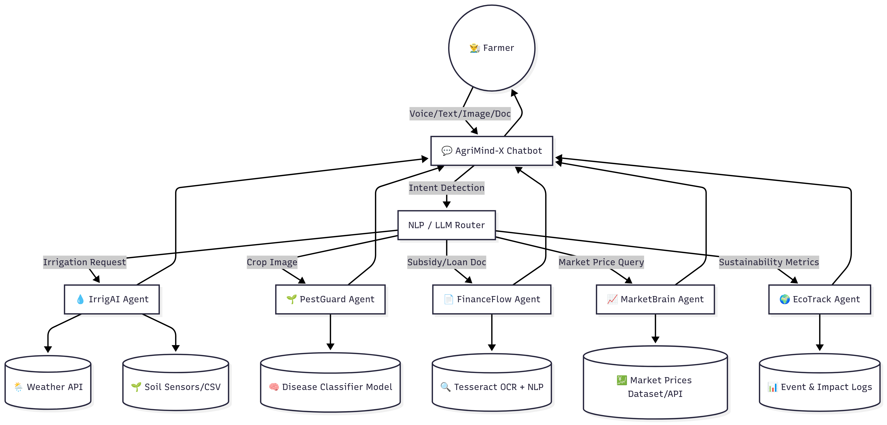

# AgriMind-X: A Multimodal, Multi-Agent AI Platform for Empowering Indian Farmers

---

## The Idea

AgriMind-X is a unified, AI-powered platform that empowers Indian farmers with hyperlocal, actionable, and explainable advice on irrigation, crop health, financial access, market trends, and sustainability. By combining multimodal AI (text, voice, image) and multi-agent architecture, we bridge the gap between cutting-edge technology and the real needs of rural India—boosting productivity, resource efficiency, and financial inclusion.

---

## The Problem

- Fragmented, single-purpose apps
- Language barriers (most tools are English-only)
- Lack of real-time, hyperlocal advice
- Complex government schemes and paperwork
- No explainability or confidence in AI outputs
- Limited access to expert guidance for smallholder farmers

---

## Your Solution

- Multi-agent AI: Specialized agents for irrigation, crop health, finance, market, and sustainability
- Multimodal input: Farmers interact via text, voice, or images (Hindi/English)
- Real-time data: Weather, market, and government data integrated for context-aware advice
- Explainable AI: Every recommendation includes a “why” and confidence score
- Mobile-first, farmer-friendly UI

---

## Data Sources

- **Weather:** OpenWeatherMap API (real-time, location-based)
- **Market Prices:** Mock CSVs, expandable to real APIs
- **Soil & Sensor Data:** Simulated for demo, IoT-ready
- **Images:** Farmer-uploaded, processed via Cloudinary
- **Voice/Text:** User input in Hindi/English
- **Preprocessing:** Data normalization, prompt engineering for LLMs
- **Challenges:** Data granularity, language diversity, image quality

---

## Technology & Architecture

- **Frontend:** React Native (Expo), Expo EAS, TypeScript
- **Backend:** FastAPI, Python, Pydantic, REST APIs
- **AI/LLM:** OpenRouter (Google Gemma, DeepSeek), prompt engineering
- **Vision:** Cloudinary for image upload, LLMs for image analysis
- **Voice:** Expo AV, speech-to-text (planned)
- **Data:** OpenWeatherMap, mock CSVs
- **Infra:** Docker, Render, Expo Go

---

## Architecture Diagram

---

## Overcoming Challenges

- **Hallucinations:** Prompt engineering, confidence scores, explainability
- **Inconsistencies:** Modular agent design, clear system prompts
- **Scalability:** Cloud-native, Dockerized, microservice-ready
- **Language:** Hindi/English support, extensible to more Indic languages
- **Data Quality:** Fallbacks for missing/low-quality data

---

## Demo Walkthrough

- **Voice Query:** “Kab paani dena hai?” → IrrigAI gives weather-aware irrigation advice in Hindi
- **Image Upload:** Leaf photo → PestGuard detects disease and suggests treatment
- **Form Scan:** Subsidy form → FinanceFlow extracts fields, auto-fills application
- **Market Query:** “Should I sell my paddy tomorrow?” → MarketBrain gives sell/hold advice

---

## Impact on End User

- **For Farmers:**
  - Hyperlocal, actionable advice in their language
  - Voice, image, and text input for accessibility
  - Automated paperwork and market insights
  - Transparent, explainable AI recommendations

- **For Officials/Advisors:**
  - Scalable, data-driven support for large farmer populations
  - Event logs and impact metrics

---

## Future Scope

- Add more Indic languages and dialects
- Integrate real IoT sensor data
- Fine-tune vision models on local crops
- Real-time financial APIs for microloans/insurance
- Blockchain-based supply chain traceability
- Full speech-to-text and text-to-speech
- Farmer community features

---

## Reflections

- **Key Learnings:**
  - Multimodal, multi-agent AI can bridge the digital divide in agriculture
  - Prompt engineering and explainability are critical for trust
  - Real-world deployment needs robust data, language, and UX design

- **Hackathon Insights:**
  - Rapid prototyping with open APIs and cloud tools is powerful
  - Farmer-centric design and local context are essential for impact

---
