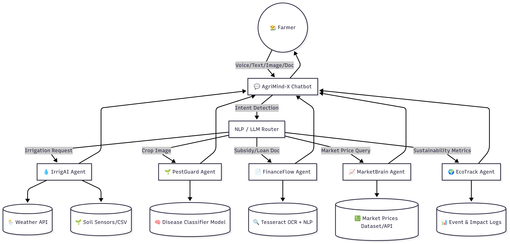

# 🌾 AgriMind-X — Multimodal Multi-Agent AI for Next-Gen Agriculture

---

## 📱 Download the Latest APK

**Try the AgriMind-X mobile app:**
[Download APK from Expo](https://expo.dev/accounts/chotukv/projects/agrimind-x/builds/34727251-ebbe-4920-8013-3ca1ca8f661f)

---

AgriMind-X is a **multimodal, multi-agent AI platform** designed to autonomously manage key aspects of agriculture: irrigation, crop health, financial access, market forecasting, and sustainability tracking.

It is built as a **hackathon-ready starter kit** with:

* **FastAPI backend** (agents, routes, mock logic, event logging)
* **React Native frontend skeleton** (mobile-first, farmer-friendly UI)
* **Sample agricultural datasets** (soil moisture, market prices, weather, subsidy docs)
* **Mermaid diagrams** (system architecture, UX flow, impact visualization)
---

## 🚀 Features

### 🤖 Agents

* **IrrigAI** → Decides irrigation based on soil moisture & rainfall forecast.
* **PestGuard** → Detects diseases/deficiencies from crop leaf images (mock classifier).
* **FinanceFlow** → Extracts data from subsidy/loan forms via OCR & auto-fills applications.
* **MarketBrain** → Predicts market trends and suggests “Sell/Hold” actions.
* **EcoTrack** → Estimates water savings & carbon footprint from AI-driven actions.
SoilSense Agent – Monitors soil health & advises on fertilization

### 🧠 Multimodality

* **Vision** (images): Detect crop disease.
* **Speech** (voice input): Ask questions in English/Hindi.
* **Text/OCR**: Extract fields from subsidy/loan documents.
* **Sensors**: Soil & weather data (mocked for demo).
* **Data Feeds**: Market prices & forecasts.

---

## 🏗️ Architecture Diagram



---

## 📂 Project Structure

```
agrimind-x/
├── backend/                # FastAPI backend
│   ├── app/
│   │   ├── agents/         # Agent logic (irrigai, pestguard, financeflow, etc.)
│   │   ├── routes/         # API endpoints
│   │   ├── core/           # Schemas, utils, config
│   │   └── main.py         # FastAPI entrypoint
│   ├── requirements.txt
│   └── Dockerfile
├── frontend/               # React Native skeleton
│   ├── App.js
│   ├── screens/
│   └── components/
├── data/                   # Sample datasets
│   └── samples/
│       ├── soil.csv
│       ├── market_prices.csv
│       ├── forecast.json
│       └── finance_note.txt
├── docs/                   # Diagrams (Mermaid)
│   └── diagrams/
│       └── system_architecture.mmd
├── infra/                  # Deployment configs
│   └── docker-compose.yml
└── README.md
```

---

## ⚡ Quickstart

### Backend (FastAPI)

```bash
cd backend
python -m venv .venv
source .venv/bin/activate   # Windows: .venv\Scripts\activate
pip install -r requirements.txt
# Copy .env.example to .env and fill in your API keys (Cloudinary, OpenWeather, etc.)
uvicorn app.main:app --reload --port 8000
```

API will be live at: **[http://localhost:8000/docs](http://localhost:8000/docs)**

### Frontend (React Native/Expo)

```bash
cd agrimind-x/agrimind-x
npm install
npx expo start
```
- The app will use the production backend at https://agrimind-x.onrender.com/ by default.
- To use a local backend, change the API URL in `app/(tabs)/explore.tsx`.

### Build APK (Expo EAS)

```bash
cd agrimind-x/agrimind-x
npx eas build --platform android --profile production
```
- The APK will connect to the production backend.

### Docker (optional)

```bash
cd infra
docker-compose up --build
```

---

## 🔌 API Endpoints

| Endpoint                | Description                                   |
| ----------------------- | --------------------------------------------- |
| `POST /infer/pestguard` | Upload crop image → detect disease/deficiency |
| `POST /decide/irrigai`  | Soil & rain data → irrigation decision        |
| `POST /ocr/financeflow` | Upload subsidy doc → extract fields           |
| `POST /finance/submit`  | Submit loan/insurance request (mock)          |
| `GET  /market/forecast` | Get “Sell/Hold” recommendation                |
| `GET  /events/recent`   | Event log of recent agent actions             |

---

## 📊 Sample Data

* **Soil CSV** → Simulated hourly soil moisture.
* **Market Prices CSV** → Daily price data for paddy.
* **Weather Forecast JSON** → Mock 48h rainfall prediction.
* **Finance Note TXT** → Sample subsidy/loan form text.

---

## 📈 Success Metrics

* **Adoption Rate** (% farmers using app).
* **Yield Improvement** (% crop gain vs baseline).
* **Financial Access** (# of loan/insurance applications auto-completed).
* **Resource Savings** (liters of water saved per acre).
* **Prediction Accuracy** (disease/price forecast confidence).
* **Sustainability Impact** (carbon reduction estimate).

---

## 🛡️ AI Alignment & Safety

* **Consent Gate** → Farmer must approve before finance/market actions.
* **Explainable Outputs** → Each decision has a “Why?” explanation.
* **Confidence Thresholds** → Low-confidence results suggest consulting an expert.
* **Privacy** → Sensitive IDs redacted on-device before submission.
* **Fairness** → Same inputs yield same outputs regardless of farmer profile.

---

## 📅 Hackathon Demo Flow (8 min)

1. **Voice Input (Hindi/English)** → “Kab paani dena hai?” → IrrigAI reply.
2. **Image Upload** → PestGuard detects disease + treatment.
3. **Doc Scan** → FinanceFlow extracts fields, auto-fills form.
4. **Market Forecast** → MarketBrain advises “Sell 30% tomorrow”.
5. **Dashboard** → Events log with impact metrics.
6. **Alignment** → Show consent, override, and explanations.

---

## 🔮 Future Enhancements

* Integrate **real IoT hardware sensors**.
* Fine-tune disease models on **local crop datasets**.
* Add **real-time financial APIs** for microloans & insurance.
* Expand multilingual voice interaction.
* Blockchain-based traceability for **supply chain transparency**.

---

## 📜 License

MIT — free to use and extend.

---

## 🗝️ Environment Variables (.env)

The backend requires the following environment variables in a `.env` file (see `.env.example`):

- `CLOUDINARY_CLOUD_NAME` — Your Cloudinary cloud name (for image/audio upload)
- `CLOUDINARY_API_KEY` — Your Cloudinary API key
- `CLOUDINARY_API_SECRET` — Your Cloudinary API secret
- `CLOUDINARY_URL` — (Optional) Full Cloudinary URL for SDKs
- `OPENROUTER_API_KEY` — API key for OpenRouter (LLM access)
- `OPENWEATHER_API_KEY` — API key for OpenWeatherMap (weather data)

**How to set up:**
1. Copy `.env.example` to `.env` in the `backend/` directory.
2. Fill in your API keys as provided by Cloudinary, OpenRouter, and OpenWeatherMap.
3. Restart your backend server after editing `.env`.

---

## 🔑 How to Get API Keys

**Cloudinary**
- Go to https://cloudinary.com/ and sign up for a free account.
- After verifying your email, go to the Cloudinary Dashboard.
- Copy your `cloud_name`, `API Key`, and `API Secret` from the dashboard.

**OpenRouter**
- Go to https://openrouter.ai/ and sign up or log in.
- Navigate to the API Keys section in your account dashboard.
- Click “Create API Key” and copy the generated key.
- If you see “Unlimited” quota, you can use this key for all LLM requests.

**OpenWeatherMap**
- Go to https://openweathermap.org/ and create a free account.
- After verifying your email, go to the API keys section in your profile.
- Click “Create key” and copy the generated key.

**Setup Steps:**
1. Copy `.env.example` to `.env` in the `backend/` directory.
2. Paste your keys into the corresponding variables.
3. Restart your backend server after editing `.env`.

---
